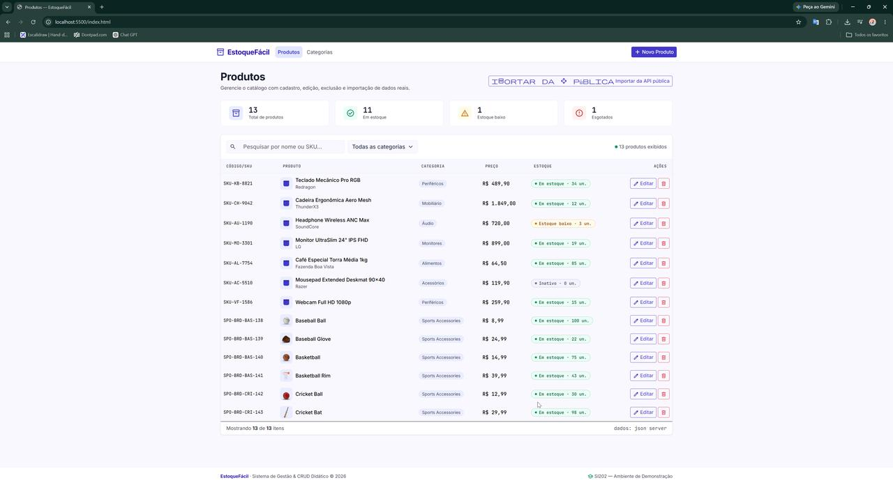
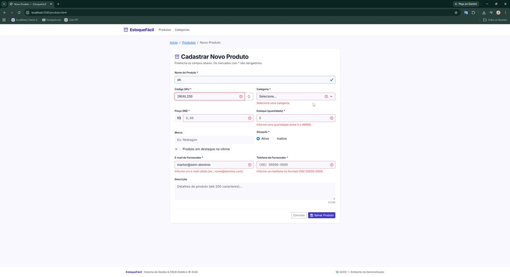
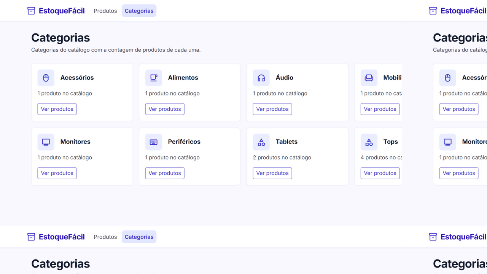

# EstoqueFácil

Autor: Marlon José Rodrigues da Silva (GitHub: [@marlonjose](https://github.com/marlonjose))

Este projeto tem como objetivo implementar progressivamente e de forma didática uma aplicação web inspirada em operações comuns de gestão de estoque (ex: catálogo de produtos, categorias, preços, status de inventário e operações de CRUD), sendo o diferencial a resiliência offline: quando a API fake não está disponível, a aplicação degrada automaticamente para o Web Storage (localStorage), mantendo o CRUD funcional no navegador. O catálogo também pode importar dados reais da API pública DummyJSON.

O frontend da aplicação foi desenvolvido com HTML, CSS (Bootstrap + Sass) e JavaScript e o backend foi simulado pela implementação de uma API Fake, usando o JSON Server.

## 📚 Documentação do Projeto

Para entender as regras de negócio, o escopo e a arquitetura técnica da aplicação, consulte os documentos abaixo:

- 📄 [Product Requirements Document (PRD)](docs/prd.md) - Visão geral, atores e histórias de usuário.
- 🛠️ [Especificação Técnica (Tech Spec)](docs/spec.md) - Versões exatas das tecnologias, dicionário de dados e rotas da API (JSON Server).
- 🏗️ [Arquitetura (SDD)](docs/architecture.md) - Estrutura de pastas, módulos JavaScript e fluxo de dados.

## 🎨 Design

- 🎨 [Design System](docs/design-tokens.md) - Identidade visual (tokens SCSS aplicados ao Bootstrap).
- 🖼️ Protótipo interativo - Telas da aplicação geradas por IA (Stitch): [code.html](docs/prototipo/code.html) + [screen.png](docs/prototipo/screen.png).
- 🌐 Site em Produção - GitHub Pages: <https://marlonjose.github.io/si202-web-framework-css/>

## 💻 Tecnologias e Dependências

- Framework CSS: **Bootstrap 5.3.8** (+ **Sass** para o Design System customizado)
- JavaScript:
  - **JQuery** - Para realizar animações e manipulação do DOM.
  - **jQuery Mask Plugin** - Máscaras de moeda e telefone nos formulários.
  - **uuid** - Identificadores únicos no modo local (Web Storage).
  - **JSON Server** - Para simular uma API REST.
- Ferramentas: **ESLint** + **Prettier** (qualidade e padronização do código) e **gh-pages** (deploy).

> As bibliotecas de frontend (Bootstrap, jQuery e jQuery Mask) são **instaladas via NPM** (`package.json`) e servidas localmente, sem links de CDN: o script `npm run copy-libs` copia os arquivos `dist` do `node_modules` para a pasta `assets/libraries/` (não versionada — regenerada pelo próprio `npm i`), que é referenciada pelas páginas HTML. O deploy para o GitHub Pages monta uma pasta `dist/` com o site completo via `npm run build:dist` (também não versionada).

## ✅ Checklist | Indicadores de Desempenho (ID) dos Resultados de Aprendizagem (RA)

**RA1 - Utilizar Frameworks CSS para estilização de elementos HTML e criação de layouts responsivos.**

- [x] ID 01 - Prototipa interfaces adaptáveis para no mínimo os tamanhos de tela mobile e desktop, usando ferramentas de design tradicionais (Figma, Quant UX ou Sketch) ou IA (Stitch). → Protótipo Stitch: `docs/prototipo/code.html` / `screen.png`
- [x] ID 02 - Implementa layout responsivo com Framework CSS (Bootstrap, Materialize, Tailwind + DaisyUI) usando Flexbox ou Grid do próprio framework. → Grid do Bootstrap: navbar, `row-cols-*`, `table-responsive`
- [x] ID 03 - Implementa layout responsivo com CSS puro, usando Flexbox ou Grid Layout. → Cards de estatísticas em CSS Grid (`auto-fit` + `minmax`)
- [x] ID 04 - Utiliza componentes prontos de um Framework CSS (ex.: card, button) e componentes JavaScript do framework (ex.: modal, carousel). → Navbar, cards, tabela, formulários e modal (JS do Bootstrap)
- [x] ID 05 - Cria layout fluido usando unidades relativas (vw, vh, %, em, rem) no lugar de unidades fixas (px). → Função SCSS `rem()` e `min-vh-100`
- [x] ID 06 - Aplica um Design System consistente (cores, tipografia, padrões de componentes) em toda a aplicação. → Tokens SCSS aplicados ao Bootstrap em todas as páginas
- [x] ID 07 - Utiliza Sass (SCSS) com ou sem framework, aplicando variáveis, mixins e funções para modularizar o código. → Tokens em `scss/_tokens.scss` (variáveis, `@function rem()`, `@mixin card-surface/focus-ring`) + um SCSS por página; mapa `$status-cores` + `@each`
- [x] ID 08 - Aplica tipografia responsiva (media queries mobile first) ou tipografia fluida (função clamp() + unidades relativas). → Tipografia fluida com `clamp()` (`.page-title`)
- [x] ID 09 - Aplica técnicas de responsividade de imagens usando CSS (object-fit, containers com unidades relativas). → `object-fit: cover` nas miniaturas da tabela
- [x] ID 10 - Otimiza imagens usando formatos modernos (WebP) e carregamento adaptativo (srcset, picture, ou parâmetros do Cloudinary). → WebP + `srcset` 1x/2x (`assets/resources/images/placeholder-*.webp`)

**RA2 - Realizar tratamento de formulários e aplicar validações customizadas no lado cliente.**

- [x] ID 11 - Implementa validação HTML nativa (campos obrigatórios, tipos, limites de caracteres) com mensagens de erro/sucesso no lado cliente. → `required`, `minlength`, `pattern`, `min/max` com mensagens em português
- [x] ID 12 - Aplica expressões regulares (REGEX) para validações customizadas (e-mail, telefone, datas, etc.) → Regex de SKU, preço (moeda BR), e-mail e telefone
- [x] ID 13 - Utiliza elementos de seleção em formulários (checkbox, radio, select) para coleta de dados. → `select` (categoria), `radio` (situação), `checkbox`/switch (destaque)
- [x] ID 14 - Implementa leitura e escrita no Web Storage (localStorage/sessionStorage) para persistir dados localmente. → `localStorage` (fallback de persistência) e `sessionStorage` (toast pós-salvamento)

**RA3 - Aplicar ferramentas para otimização do processo de desenvolvimento web.**

- [x] ID 15 - Configura ambiente com Node.js e NPM para gerenciamento de pacotes e dependências. → Dependências de produção e desenvolvimento no `package.json`
- [x] ID 16 - Utiliza boas práticas de versionamento no Git/GitHub (branch main ou branches específicos, uso de .gitignore). → Branch `main`, `.gitignore` (node_modules/.env), commits semânticos
- [x] ID 17 - Mantém um README.md padronizado, conforme template da disciplina, com checklist preenchido. → Este README
- [x] ID 18 - Organiza arquivos do projeto de forma modular, seguindo padrão de exemplo fornecido. → `app/` (páginas autocontidas em `app/pages/<nome>/`, camadas `model/`, `service/`, `util/`), `assets/` (`libraries` + `resources`), `scss/`, `db/`, `docs/`
- [x] ID 19 - Configura linters e formatadores (ESLint, Prettier) para manter qualidade e padronização do código. → ESLint 9 + Prettier (`npm run lint` / `npm run format`)

**RA4 - Aplicar bibliotecas de funções e componentes em JavaScript para aprimorar a interatividade de páginas web.**

- [x] ID 20 - Utiliza jQuery para manipulação do DOM e interatividade (eventos, animações, manipulação de elementos) → Eventos, renderização da tabela e animações `fadeIn`/`fadeOut` do toast
- [x] ID 21 - Integra e configura um plugin jQuery relevante (ex.: jQuery Mask Plugin). → Máscara de moeda `#.##0,00` (reversa) e telefone `(00) 00000-0000`

**RA5 - Efetuar requisições assíncronas para uma API fake e APIs públicas, permitindo a obtenção e manipulação de dados dinamicamente.**

- [x] ID 22 - Realiza requisições assíncronas para uma API fake (ex.: JSON Server) para persistir dados de um formulário. → `fetch`/`async-await` com `POST`/`PUT /produtos`
- [x] ID 23 - Realiza requisições assíncronas para uma API fake para exibir dados na página. → `fetch`/`async-await` com `GET /produtos` na tabela
- [x] ID 24 - Realiza requisições assíncronas para APIs públicas reais (OpenWeather, ViaCEP etc.), exibindo os dados e tratando erros. → **DummyJSON** (`/products`) com exibição de dados e tratamento de erros (timeout, toast/alerta)

## 🚀 Manual de execução

1. Clonar o repositório com `git clone`
2. Fazer checkout no branch `main` que contém as modificações mais recentes
3. Abrir o projeto no editor Visual Studio Code (VS Code)
4. Abrir um terminal pelo VSCode ou qualquer terminal do seu Sistema Operacional apontando para o diretório raiz do projeto
5. Instalar as dependências contidas no package.json
   - Comando: `npm i`
   - Ao final da instalação, o script `postinstall` copia automaticamente Bootstrap, jQuery e jQuery Mask do `node_modules` para a pasta `vendor/` (para atualizar manualmente depois de trocar versões: `npm run copy-libs`)
6. (Opcional) Instalar o JSON Server globalmente disponível em <https://www.npmjs.com/package/json-server>
   - Comando: `npm i -g json-server`
   - É opcional porque a dependência já vem cadastrada no arquivo package.json para instalação local na pasta node_modules
7. Executar a API Fake (JSON Server) via um dos seguintes comandos:
   - Execução via script registrado no package.json: `npm run api`
   - Ou via Execução explícita: `json-server --watch db/db.json --port 3000`
   - O comando para execução do JSON Server deve ser aplicado no diretório raiz do projeto, ou seja, que contém o arquivo `db/db.json`
   - Por padrão, a aplicação JSON Server executa no endereço localhost:3000
8. Executar o projeto frontend, escolhendo uma das opções (a página inicial está em `app/index.html`):
   - Pela extensão Live Server do VS Code (abrir o `app/index.html`)
   - Ou via servidor estático na raiz do projeto: `npx http-server -p 5500 .`
   - Ou via Python: `python -m http.server 5500`
   - > As páginas carregam o menu/rodapé via jQuery (`.load`), portanto precisam ser servidas por HTTP (Live Server/http-server) — abrir o arquivo direto pelo navegador (protocolo `file://`) não carrega esses partes.
9. Acessar <http://localhost:5500/app/>

> Sem a API fake o app continua funcional: o selo **"Modo local · Web Storage"** aparece no topo e os dados persistem no navegador. Scripts auxiliares: `npm run sass`, `npm run sass:watch`, `npm run lint`, `npm run format`, `npm run copy-libs` e `npm run deploy` (GitHub Pages — monta a `dist/` e publica automaticamente via `predeploy`).

## 📱 Telas da aplicação

### Produtos (listagem, estatísticas, busca e importação da API pública)

### Formulário com validação (Regex + máscaras + estados de erro do Bootstrap)

### Categorias (locais + reais da API pública)

---

https://github.com/marlonjose/si202-web-framework-css
